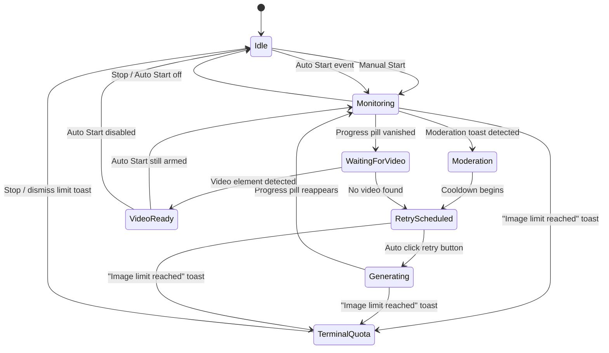

## Plan: Grok Retry Panel

Floating Grok control panel that watches for Sonner moderation toasts on Grok imagine pages, schedules user-configurable cooldown retries with a visible progress bar, and persists panel settings through Tampermonkey storage.

### Implemented Steps
1. `src/App.jsx` now renders a fixed bottom-right `.grok-panel` with `isRunning`, `attempts`, `status`, cooldown state, a slider-backed `maxRetries`, and a numeric cooldown input—all persisted via `GM_getValue`/`GM_setValue`.
2. `src/grokAutomation.js` encapsulates DOM selectors: it observes `section[aria-label="Notifications alt+T"] li.group.toast[data-type="error"]` for “Content Moderated…” events and exposes `triggerRetry()` targeting `button[data-slot="button"].bg-button-filled[aria-label="生成视频"]`.
3. React effects gate StrictMode double-runs, start/stop the moderation observer, and manage configurable cooldown timers that tick a progress bar before calling `triggerRetry()`; reaching `maxRetries` halts automation with a clear status message.
4. `src/storage.js` wraps Tampermonkey storage for both max retries and cooldownms, and `vite.config.js` now declares `match: ['https://grok.com/imagine/post/*']` plus the `GM_getValue`/`GM_setValue` grants required at runtime.
5. `src/App.css` introduces scoped `.grok-*` styles for the overlay, slider, and progress bar, while `src/index.css` stays empty to avoid leaking globals into Grok’s DOM.

### Remaining Considerations
1. Consider console or in-panel logging for button-selector failures to aid troubleshooting when Grok’s markup shifts.
2. If retries should persist across page reloads while running, add serialization for `attempts`/`status`, not just slider/input values.

### Video Generation State Machine

